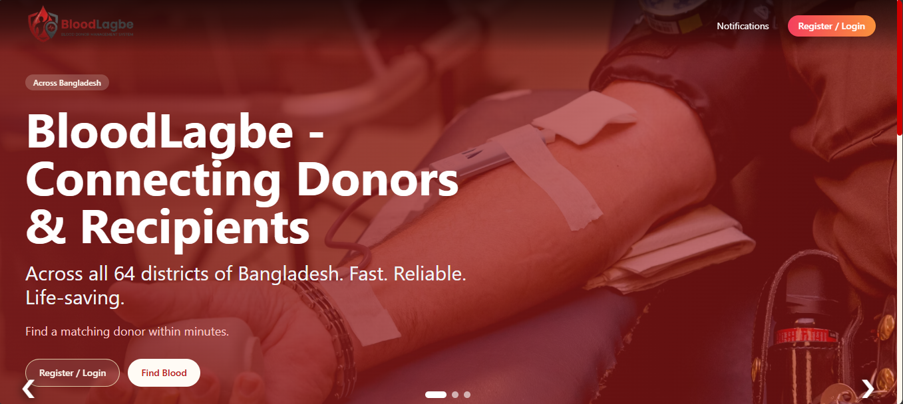
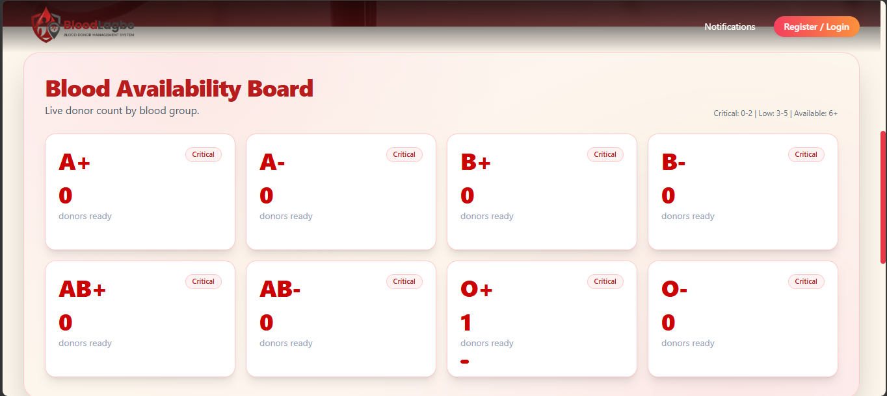
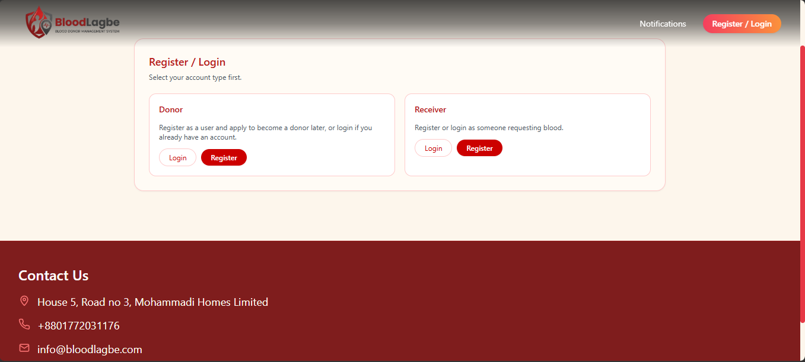
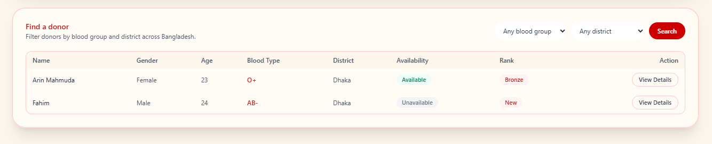
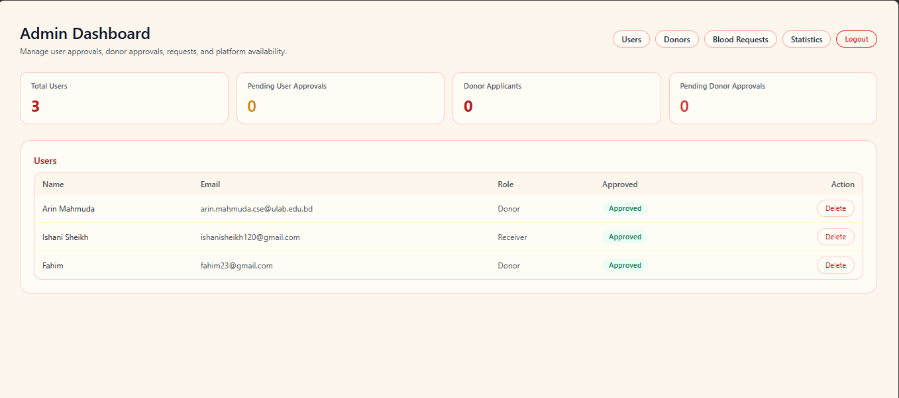

[README.md](https://github.com/user-attachments/files/31619420/README.md)
# 🩸 BloodLagbe — Blood Donor Management System

BloodLagbe is a full-stack web app that connects blood donors with people who need blood, built with a **Spring Boot** REST API and a **React (Vite)** frontend.



---

## Tech Stack

**Backend**
- Java 17, Spring Boot 3.3.4
- Spring Web, Spring Security, Spring Data JPA
- JWT authentication (`jjwt`)
- MySQL (runtime), H2 available for local/dev use
- Maven

**Frontend**
- React 19 + Vite 7
- React Router 7
- Tailwind CSS
- Axios (API calls)
- Recharts (statistics/charts)

---

## Project Structure

```
BloodLagbe/
├── backend/
│   └── src/main/java/com/bloodlagbe/
│       ├── controller/     # REST controllers (Auth, Admin, Donor, BloodRequest, Notification, Profile)
│       ├── entity/         # JPA entities: User, Donor, BloodRequest, Notification
│       ├── repository/     # Spring Data JPA repositories
│       ├── service/        # Business logic
│       ├── security/       # JWT & auth filters
│       └── config/         # App configuration (CORS, security, etc.)
│   └── src/main/resources/application.properties
└── frontend/
    └── src/
        ├── pages/           # HomePage, LoginPage, RegisterPage, AuthChoicePage,
        │                    # DonorListPage, DonorDetailsPage, ProfilePage,
        │                    # NotificationsPage, admin/AdminDashboardPage
        └── lib/api.js       # Axios client
```

---

## Features

Based on the actual API surface:

**Auth** (`/api/auth`)
- Register, login (JWT issued on login)

**Donors** (`/api`)
- Browse/search donors, view a donor's details
- Apply to become a donor (with optional health document upload)
- Toggle own availability
- View donor availability statistics
- Admins can remove a donor listing

**Blood Requests** (`/api`)
- Submit a blood request
- Accept / reject a request (donor side)
- View incoming and outgoing requests

**Notifications** (`/api/notifications`)
- Fetch notifications, mark as read

**Profile** (`/api/profile`)
- View and update your own profile

**Admin** (`/api/admin`)
- List all users and donors
- Approve / reject user registrations
- Approve / reject donor applications
- Delete users or donor listings
- View platform statistics and all blood requests
- View/manage donor health documents

---

## Screenshots

| Homepage | Blood Availability Board |
|---|---|
|  |  |

| Register / Login | Donor Search |
|---|---|
|  |  |

| Admin Dashboard |
|---|
|  |

---

## Getting Started

### Prerequisites
- Java 17+ and Maven
- Node.js and npm
- MySQL running locally

### Backend

The backend expects a local MySQL instance (see `backend/src/main/resources/application.properties`):

```properties
spring.datasource.url=jdbc:mysql://localhost:3306/bloodlagbe?createDatabaseIfNotExist=true&useSSL=false&allowPublicKeyRetrieval=true&serverTimezone=UTC
spring.datasource.username=root
spring.datasource.password=
```

Update the username/password for your environment, then run:

```bash
cd backend
mvn spring-boot:run
```

The API starts on **http://localhost:8080**.

> ⚠️ Also update `bloodlagbe.jwt.secret` in `application.properties` before deploying — the default is a placeholder.

### Frontend

```bash
cd frontend
npm install
npm run dev
```

The dev server runs on **http://localhost:5173** (the default CORS origin allowed by the backend).

---

## Configuration Notes

- CORS allowed origin is set via `bloodlagbe.cors.allowed-origins` in `application.properties` (defaults to `http://localhost:5173`).
- JWT expiration is configurable via `bloodlagbe.jwt.expiration-ms` (defaults to 24 hours).
- `spring.jpa.hibernate.ddl-auto=update` — schema is auto-managed by Hibernate against the MySQL database.

---

## License

Academic project — no license specified.
